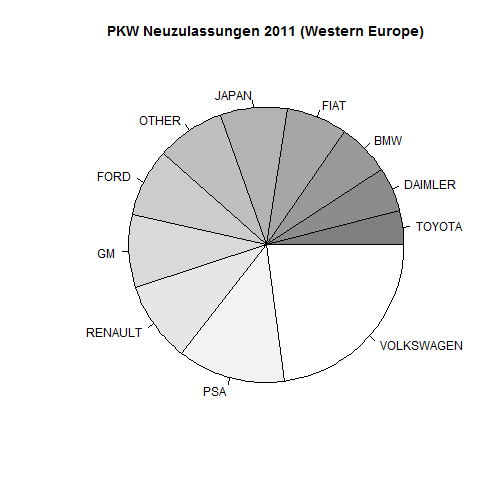
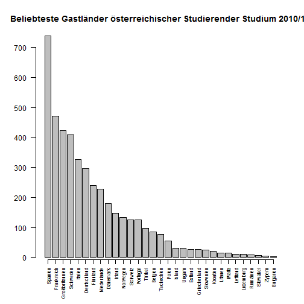
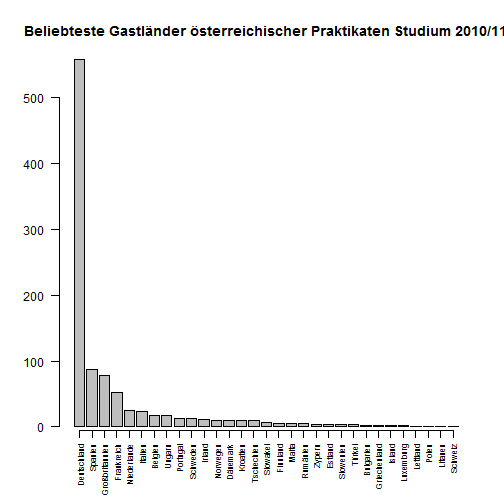
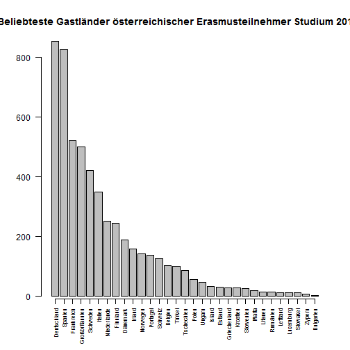
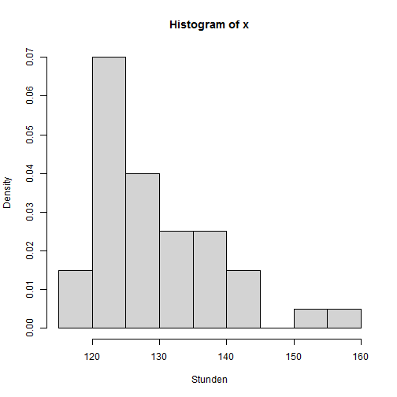
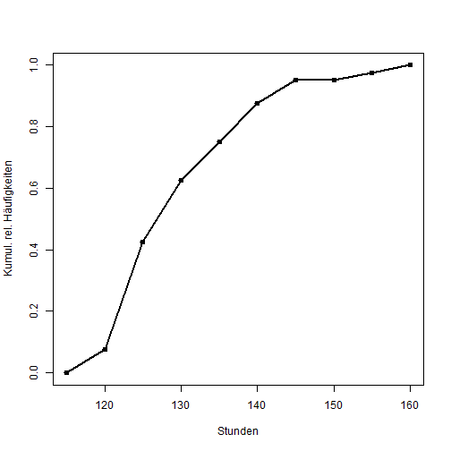
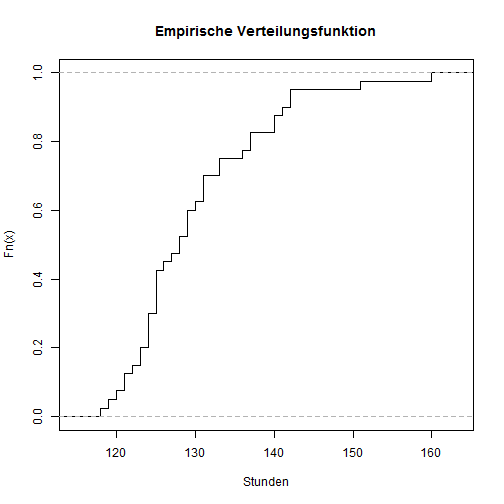
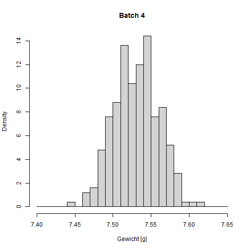
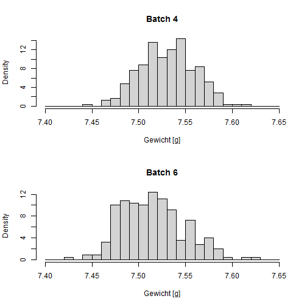

Uebung 2 - 09.10.2012
=====================
  
Aufgabe 1.1
-----------
  

```r
pkw = read.table("../ue_statwth_inf12/Daten/pkw-neuzul11.dat", header = TRUE, 
    sep = ";")

total = sum(pkw$TOTAL)

pkw.big_groups = pkw[pkw$TOTAL * 100/total > 3, ]
pkw.other = data.frame(GROUP = "OTHER", TOTAL = total - sum(pkw.big_groups$TOTAL))
pkw.summarized = rbind(pkw.big_groups, pkw.other)

rank = sort(pkw.summarized$TOTAL, index.return = TRUE)

pie(pkw.summarized$TOTAL[rank$ix], labels = pkw.summarized$GROUP[rank$ix], col = gray(seq(0.5, 
    1, length = dim(pkw.summarized)[1])), main = "PKW Neuzulassungen 2011 (Western Europe)")
```

 


Aufgabe 1.2
-----------


```r
dat <- read.table("../ue_statwth_inf12/Daten/erasmus1011.dat", header = TRUE, 
    skip = 1)

students = dat$Stud
names(students) = dat$Länder

students.rank = sort(students, decreasing = TRUE, index.return = TRUE)

barplot(students[students.rank$ix], las = 2, cex.names = 0.7, axis.lty = 1, 
    main = "Beliebteste Gastländer österreichischer Studierender Studium 2010/11")
```

 

```r

praktikanten = dat$Prak
names(praktikanten) = dat$Länder

praktikanten.rank = sort(praktikanten, decreasing = TRUE, index.return = TRUE)

barplot(praktikanten[praktikanten.rank$ix], las = 2, cex.names = 0.7, axis.lty = 1, 
    main = "Beliebteste Gastländer österreichischer Praktikaten Studium 2010/11")
```

 

```r


erasmusteilnehmer = dat$Prak + dat$Stud
names(erasmusteilnehmer) = dat$Länder

erasmusteilnehmer.rank = sort(erasmusteilnehmer, decreasing = TRUE, index.return = TRUE)

barplot(erasmusteilnehmer[erasmusteilnehmer.rank$ix], las = 2, cex.names = 0.7, 
    axis.lty = 1, main = "Beliebteste Gastländer österreichischer Erasmusteilnehmer Studium 2010/11")
```

 


Aufgabe 1.4
-----------

### a
Histogramm

```r

x = scan("../ue_statwth_inf12/Daten/alt.dat")
hist.alt = hist(x, freq = FALSE, xlab = "Stunden", col = "lightgrey")
```

 


### b 
Häufigkeitsverteilung anhand eines Stemplots

```r
stem(x)
```

```
## 
##   The decimal point is 1 digit(s) to the right of the |
## 
##   11 | 89
##   12 | 0112334444
##   12 | 555556788999
##   13 | 011133
##   13 | 677
##   14 | 00122
##   14 | 
##   15 | 1
##   15 | 
##   16 | 0
```


Aufgabe 1.5
------------

### a
Summenpolygon der relativen Häufgikeiten

```r
n = length(x)
plot(hist.alt$breaks, c(0, cumsum(hist.alt$counts))/n, type = "o", pch = 19, 
    lwd = 2, xlab = "Stunden", ylab = "Kumul. rel. Häufigkeiten")
```

 


### b
empirsche Verteilungsfunktion:


```r
plot(ecdf(x), verticals = TRUE, do.points = FALSE, xlab = "Stunden", main = "Empirische Verteilungsfunktion")
```

 


Aufgabe 1.6
-----------

### a

```r

euro.batch4 = read.table("../ue_statwth_inf12/Daten/euroweight4.dat", header = TRUE, 
    skip = 1)[, 2]
breaks = seq(7.4, 7.65, by = 0.01)
hist(euro.batch4, breaks = breaks, freq = FALSE, main = paste("Batch", 4), xlab = "Gewicht [g]", 
    col = "lightgrey")
```

 

```r

```


### b

```r
euro.batch6 = read.table("../ue_statwth_inf12/Daten/euroweight6.dat", header = TRUE, 
    skip = 1)[, 2]

par(mfrow = c(2, 1))
hist(euro.batch4, breaks = breaks, freq = FALSE, main = paste("Batch", 4), xlab = "Gewicht [g]", 
    col = "lightgrey")
hist(euro.batch6, breaks = breaks, freq = FALSE, main = paste("Batch", 6), xlab = "Gewicht [g]", 
    col = "lightgrey")
```

 

```r

par(mfrow = c(1, 1))
```


Aufgabe 1.8
-----------


```r

kennz <- function(x, ro = 4) {
    param <- c(mean(x), median(x), max(x) - min(x), var(x), sd(x), sd(x)/mean(x), 
        IQR(x), mean(abs(x - mean(x))), mean(abs(x - median(x))))
    param.m <- matrix(param, ncol = 1)
    dimnames(param.m) <- list(c("Mittel", "Median", "Spannweite", "Varianz", 
        "Streuung", "VarKoef", "Quartilabstand", "MAD.Mittel", "MAD.Median"), 
        "Kennzahlen")
    return(round(param.m, ro))
}


ozontab = read.table("../ue_statwth_inf12/Daten/ozon.dat", header = TRUE)


attach(ozontab)
by(Ozon, Tag, summary)
```

```
## Tag: 1
##    Min. 1st Qu.  Median    Mean 3rd Qu.    Max. 
##     122     127     134     136     141     161 
## -------------------------------------------------------- 
## Tag: 2
##    Min. 1st Qu.  Median    Mean 3rd Qu.    Max. 
##     102     115     118     120     127     135
```

```r
by(Ozon, Tag, fivenum)
```

```
## Tag: 1
## [1] 122.0 127.0 133.5 141.0 161.0
## -------------------------------------------------------- 
## Tag: 2
## [1] 102.0 115.0 118.5 127.0 135.0
```

```r
by(Ozon, Tag, kennz, ro = 2)
```

```
## Tag: 1
##                Kennzahlen
## Mittel             135.97
## Median             133.50
## Spannweite          39.00
## Varianz            103.38
## Streuung            10.17
## VarKoef              0.07
## Quartilabstand      13.50
## MAD.Mittel           8.34
## MAD.Median           8.13
## -------------------------------------------------------- 
## Tag: 2
##                Kennzahlen
## Mittel             120.16
## Median             118.50
## Spannweite          33.00
## Varianz             56.14
## Streuung             7.49
## VarKoef              0.06
## Quartilabstand      11.75
## MAD.Mittel           6.23
## MAD.Median           6.16
```

```r
detach(ozontab)


# Quantilendefinition VO
quant.vo <- function(x, brk, p, plotit = TRUE) {
    n <- length(x)
    x.hist <- hist(x, breaks = brk, plot = FALSE)
    fr <- x.hist$counts
    xp <- numeric(length(p))
    for (k in 1:length(p)) {
        i <- max(which(cumsum(fr)/n <= p[k]))
        u <- brk[i + 1]
        o <- brk[i + 2]
        xp[k] <- u + (n * p[k] - cumsum(fr)[i]) * (o - u)/fr[i + 1]
    }
    if (plotit) {
        plot(brk, c(0, cumsum(fr)/n), type = "o", lty = 1, pch = 19, lwd = 2, 
            col = "orange2", xlab = "x", ylab = "Kum. rel. Häufigkeiten", main = "Summenpolygon", 
            axes = FALSE)
        axis(1, pos = 0, at = brk)
        axis(2, pos = brk[1])
        axis(3, pos = 1, at = brk)
        axis(4, pos = brk[length(brk)])
        for (k in 1:length(p)) {
            lines(c(brk[1], xp[k], xp[k]), c(p[k], p[k], 0), lty = 2)
        }
    }
    return(xp)
}
```

